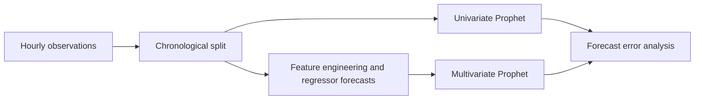

# Order Detection Time Forecasting

**Time-series forecasting, feature engineering, and backtesting**

Explore how hourly order-detection time can be forecast using Prophet, comparing a univariate baseline with a model that includes operational and engineered regressors. The notebook connects an operational prediction problem with time-series feature engineering and error analysis.

## Approach

1. Load hourly observations, separate a chronological evaluation window, and inspect missing values and outliers.
2. Engineer lag, calendar, Fourier, wavelet, derivative, and seasonal-decomposition features.
3. Fit univariate and multivariate Prophet models, including separate forecasts for future regressors.
4. Compare predictions using MAE, RMSE, and percentage-error calculations; explore cross-validation and rolling one-hour forecasts.



## Repository guide

| File | Purpose |
| --- | --- |
| [Model notebook](AOTA_DE_PROD_Model_V1.ipynb) | Feature engineering, forecasting, and evaluation experiments |
| [Forecast helper](functions.py) | Predict a test timestamp using training data and only earlier test observations |
| [EDA notebook](AO_Det_Time_Forecasting_EDA_V1.ipynb) | Documented placeholder; the original file contained no analysis |
| [Regression tests](tests/test_forecast.py) | Check forecast alignment and exclusion of the current test target |

## Interpretation and limitations

This is an exploratory forecasting study. The original data is not included, so no model-quality or deployment claim is made here. The notebook reserves the final 672 rows and evaluates the first 168 of those rows; these represent hours only if the input is complete and regularly sampled.

Regressors derived from the target must be generated using only information available at each forecast cutoff. Cross-validation that supplies observed future regressors is not equivalent to forecasting those regressors in production. Whole-series transforms and decomposition need a cutoff-by-cutoff leakage audit before relying on the multivariate comparison. The one-hour helper now excludes the target observation from training and predicts its actual timestamp.

The calculation labeled GMRAE in the historical notebook divides by the observed target, rather than a benchmark model's absolute error; it should not be interpreted as benchmark-relative GMRAE. Percentage errors also require a policy for zero targets. Next steps are a seasonal-naive baseline, rolling-origin feature generation, and reproducible evaluation on the source data.

## Getting started

Start with the [main notebook](AOTA_DE_PROD_Model_V1.ipynb). Reading the code on GitHub does not require a local environment. To execute it, obtain the original input files described in [data/README.md](data/README.md).

Use a separate Python 3.11 environment for this repository:

```bash
python -m venv .venv
# Windows PowerShell:
.venv\Scripts\Activate.ps1
# macOS/Linux: source .venv/bin/activate
python -m pip install -r requirements.txt
python -m jupyterlab
```

Launch JupyterLab from the repository root, place the required files in `data/`, and run the notebook from the first cell. Dependency ranges are inferred from the code and are a starting environment, not an exact lockfile or a verified end-to-end installation. Saved outputs and execution counts have been cleared to avoid stale results and embedded data previews. The original datasets are not distributed with this repository.

Run the focused regression tests from the repository root with `python -m unittest discover -s tests -v`. These use synthetic data and do not measure model quality.

## More projects

- [Delivery Data Anomaly Detection](https://github.com/Hao-Yuan-Chen/Delivery_data_Anomaly_Detection): Unsupervised learning, neural networks, and model evaluation.
- [Sales Opportunity Scoring](https://github.com/Hao-Yuan-Chen/Sales-Opportunity-Scoring): CRM feature engineering, classification, and precision-recall analysis.
- [Student Assessment Analysis](https://github.com/Hao-Yuan-Chen/Sparx-Learning-Technical-task): Data quality, longitudinal analysis, and statistical reasoning.
